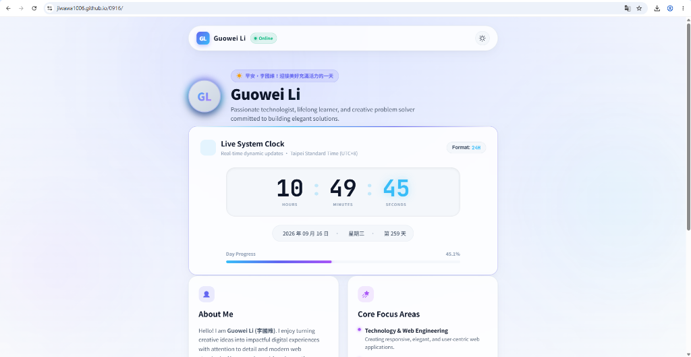
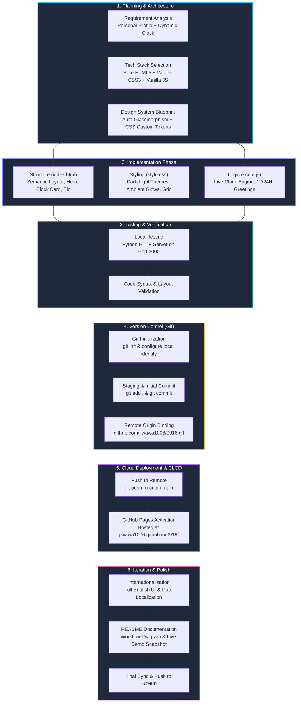

# DIC 1: ChronosProfile - Personal Web Hub & Live Clock

A modern, sleek glassmorphic personal web portal featuring an interactive real-time clock, dynamic greeting engine, and responsive UI.

- **Author**: Guowei Li (李國維)
- **Course Assignment**: DIC 1 (Do It Class 1)
- **Live Demo**: [https://jiwawa1006.github.io/0916/](https://jiwawa1006.github.io/0916/)

> **Live Demo:** [https://jiwawa1006.github.io/0916/](https://jiwawa1006.github.io/0916/)

<p align="center">
  
</p>

---

## ✨ Features & Technical Highlights

- **Personal Brand & Identity**: Distinctive profile badge, online status indicator with breathing green LED effect, and career interest tags.
- **Dynamic Real-Time Clock Dashboard**:
  - Precision live clock updating every second with glowing monospace digits.
  - Interactive **12-Hour / 24-Hour** mode toggle with dynamic AM/PM badge.
  - Comprehensive date metrics: Full date, day of the week, and day of the year.
  - Dynamic **Day Progress Bar** visualizing daily completion percentage in real time.
  - Smart time-aware greetings (Morning, Noon, Afternoon, Evening, Late Night).
- **Theme Switching**: Seamless toggle between Dark Mode and Light Mode with persistent preference saved in `localStorage`.
- **Modern Glassmorphism UI**: Built with CSS custom properties (variables), smooth ambient floating gradient orbs, and fluid mobile-first responsive layout.
- **Pure Vanilla Web Stack**: Pure HTML5, modern CSS, and vanilla JavaScript (ES6+) for blazing fast load times with zero framework overhead.

---

## 📊 Project Development Workflow

### 1. Workflow Architecture Diagram



### 2. Stage Breakdown

| Stage | Phase Name | Description & Key Actions | Deliverables |
| :---: | :--- | :--- | :--- |
| **01** | **Planning & Architecture** | Defined assignment requirements, selected zero-dependency vanilla stack, and structured UI components. | Technical implementation plan |
| **02** | **Frontend Engineering** | Built semantic HTML5 layout, custom CSS glassmorphic tokens, and JavaScript real-time clock ticker. | `index.html`, `style.css`, `script.js` |
| **03** | **Local QA & Verification** | Ran local development server, verified responsive layout, and ensured zero syntax errors. | Verified web components |
| **04** | **Version Control** | Initialized Git repository, established `main` branch, and linked remote GitHub origin. | Git commits & branch structure |
| **05** | **Cloud Deployment** | Pushed commits to GitHub and enabled GitHub Pages for continuous cloud hosting. | Live Demo URL |
| **06** | **Iteration & Documentation** | Converted content to English, captured snapshot (`preview.png`), and updated documentation. | `README.md`, `preview.png` |

---

## 🚀 Getting Started

### Direct Preview
Simply double-click or open `index.html` in any web browser.

### Local Development Server
You can also run any lightweight static web server:

```bash
# Using Python
python -m http.server 3000

# Using Node.js
npx serve .
```

Then open [http://localhost:3000](http://localhost:3000) in your browser.

---

## 📁 Project Structure

```
├── index.html     # Semantic HTML structure & SEO meta tags
├── style.css      # Glassmorphic design system, typography & animations
├── script.js      # Real-time clock engine, time greetings & theme toggle
├── preview.png    # Live website snapshot preview
└── README.md      # Comprehensive assignment documentation & workflow
```

---

## 📄 License & Credits

Designed and developed by **Guowei Li (李國維)** for **DIC 1 (Do It Class 1)**.  
All rights reserved © 2026.